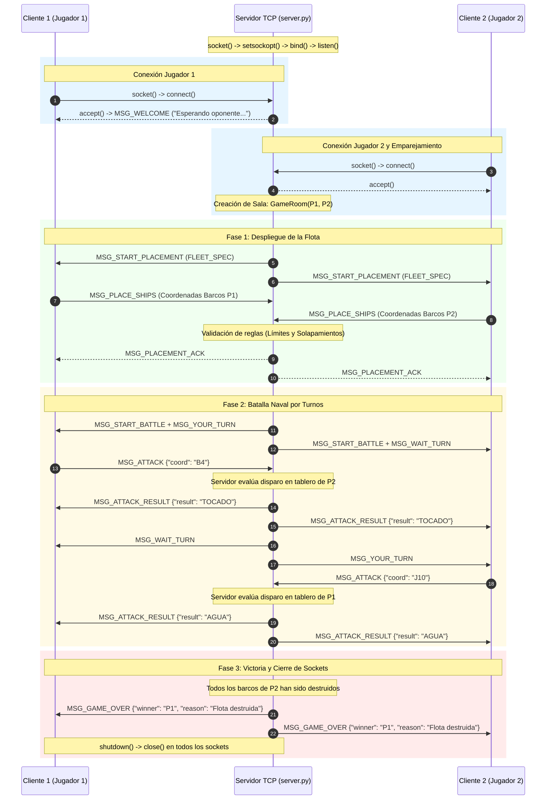

# INFORME TÉCNICO: DESARROLLO DE APLICACIÓN EN RED BASADA EN SOCKETS TCP
## Juego Multijugador: Battleship (Batalla Naval)

---

## 6.1. Portada

| Campo | Detalle |
| :--- | :--- |
| **Nombre de la Actividad** | Taller de Comunicación en Red y Programación de Sockets |
| **Nombre de la Asignatura**| Redes de Computadores / Comunicación de Datos |
| **Integrantes** | [Nombre Integrante 1]<br>[Nombre Integrante 2]<br>[Nombre Integrante 3] |
| **Docente** | [Nombre del Docente] |
| **Fecha de Entrega** | 28 de Agosto de 2026 |
| **Institución** | Departamento de Ingeniería Informática y Telecomunicaciones |

---

## 6.2. Introducción

### Contexto de la Actividad
En la arquitectura de sistemas distribuidos moderna, la comunicación interprocesos a través de redes de datos constituye la columna vertebral del intercambio de información. Los sistemas operativos proveen interfaces de programación de aplicaciones (APIs) a bajo nivel, siendo la API de **Sockets de Berkeley** el estándar de facto que permite a las aplicaciones acceder a los servicios de la capa de transporte (TCP/IP).

### Importancia de la Comunicación mediante Sockets
Los sockets abstraen la complejidad subyacente del hardware de red, los controladores de interfaz y los protocolos de enrutamiento, tratando los canales de comunicación como descriptores de archivos sobre los cuales se pueden realizar operaciones de lectura y escritura. Comprender el ciclo de vida de los sockets, los mecanismos de enlace, escucha, multiplexación y manejo de buffers es indispensable para diseñar aplicaciones en red concurrentes, seguras y escalables.

### Objetivo General del Trabajo
Diseñar, implementar, documentar y evaluar una aplicación multijugador cliente-servidor completa del clásico juego **Battleship (Batalla Naval)** en lenguaje Python 3, empleando la biblioteca nativa `socket` bajo el protocolo de transporte **TCP**, implementando enmarcado de mensajes (*Message Framing*), gestión de salas concurrentes mediante hilos (*Multithreading*), control estricto de turnos en el servidor y manejo robusto de excepciones de red.

### Protocolo Seleccionado
Se seleccionó el protocolo **TCP (Transmission Control Protocol)** mediante sockets de flujo (`socket.SOCK_STREAM`), dado que el juego requiere una estricta coherencia en el estado del tablero, entrega garantizada sin pérdidas de las coordenadas de disparo y sincronización secuencial de los turnos de ambos jugadores.

### Descripción Breve de la Aplicación Desarrollada
La aplicación se compone de un **Servidor Central (`server.py`)** y un **Cliente Interactivo de Consola (`client.py`)**:
1. El servidor escucha conexiones en un puerto TCP configurable, empareja a los jugadores de dos en dos en salas aisladas (`GameRoom`) y arbitra la partida.
2. Los clientes permiten configurar la flota de 5 barcos reglamentarios mediante un modo interactivo manual o un generador automático aleatorio.
3. Una vez validadas las flotas en el servidor, se inicia el combate por turnos con renderizado lado a lado de la flota propia y el radar enemigo en colores ANSI.
4. El servidor valida imparcialmente cada impacto (`AGUA`, `TOCADO`, `HUNDIDO`) y detecta el fin de partida o desconexiones forzadas.

---

## 6.3. Marco Conceptual

### ¿Qué es un Socket?
Un **socket** es un punto final (*endpoint*) de un enlace de comunicación bidireccional entre dos programas que se ejecutan en una red. Desde el punto de vista del sistema operativo, es un descriptor o manejador que asocia una dirección IP, un número de puerto y un protocolo de transporte determinado, permitiendo enviar y recibir flujos de bytes o datagramas.

### El Modelo Cliente-Servidor
Es un modelo de diseño distribuido que estructura las tareas entre los proveedores de un recurso o servicio, llamados **servidores**, y los demandantes del servicio, llamados **clientes**:
- **Servidor:** Proceso pasivo que inicializa un socket, lo vincula a una dirección conocida (`bind`), se coloca en estado de escucha (`listen`) y espera solicitudes entrantes (`accept`).
- **Cliente:** Proceso activo que inicializa un socket e inicia deliberadamente el contacto con el servidor mediante una solicitud de conexión (`connect`).

```text
+-------------------+                          +-------------------+
|  CLIENTE (Activo) |                          | SERVIDOR (Pasivo) |
+-------------------+                          +-------------------+
| socket()          |                          | socket()          |
|                   |                          | bind()            |
|                   |                          | listen()          |
| connect()         | --- Three-Way Handshake->| accept()          |
| [Conexión TCP]    |<========================>| [Conexión TCP]    |
| sendall() / recv()|<---- Flujo de Datos ---->| recv() / sendall()|
| close()           |                          | close()           |
+-------------------+                          +-------------------+
```

### Características de TCP vs. UDP y Comparación Técnica

| Criterio | TCP (Transmission Control Protocol) | UDP (User Datagram Protocol) |
| :--- | :--- | :--- |
| **Tipo de Socket** | `SOCK_STREAM` (Flujo continuo de bytes) | `SOCK_DGRAM` (Datagramas discretos) |
| **Orientación** | Orientado a la conexión (Requiere Three-Way Handshake) | Sin conexión (*Connectionless*) |
| **Confiabilidad** | Garantizada: retransmisión por pérdidas, control de errores (ACK/NACK) | No garantizada: los paquetes pueden perderse sin aviso |
| **Orden de Entrega** | Estricto (Secuenciamiento de paquetes por números de secuencia) | No garantizado: pueden llegar desordenados o duplicados |
| **Control de Flujo/Congestión**| Sí (Ventana deslizante, algoritmos de congestión como CUBIC/Reno) | No implementado nativamente en la capa de transporte |
| **Sobrecarga de Encabezado** | 20 a 60 bytes por segmento | 8 bytes fijos por datagrama |
| **Límites de Mensajes** | No delimita mensajes (Flujo continuo; requiere *Framing*) | Mantiene los límites de cada datagrama recibido |
| **Casos de Uso Típicos** | Web (HTTP/HTTPS), Transferencia de archivos (FTP), Juegos de turnos, SSH | Streaming de audio/video en tiempo real, VoIP, DNS, Juegos FPS |

### Justificación del Protocolo Seleccionado (TCP)
Para el desarrollo de Battleship, la elección de **TCP** es obligada por las siguientes razones de arquitectura:
1. **Tolerancia Cero a la Pérdida de Datos:** La pérdida de un mensaje que contenga un disparo o la confirmación de hundimiento desincronizaría fatalmente el estado del juego entre ambos clientes.
2. **Determinismo y Secuencia de Turnos:** TCP garantiza que el orden en que el servidor emite los eventos es exactamente el orden en que los clientes los reciben y procesan.
3. **Manejo de Estado Concurrente:** La naturaleza orientada a la conexión permite al servidor detectar de inmediato cuándo un cliente cierra el socket o pierde conectividad mediante el evento `EOF` / `ConnectionResetError`.

### Dirección IP, Puerto y Nomenclatura del Socket
Para establecer una comunicación en red se requiere la tupla `(IP_Origen, Puerto_Origen, IP_Destino, Puerto_Destino, Protocolo)`:
- **Dirección IP:** Identificador lógico de 32 bits (IPv4) o 128 bits (IPv6) de un host en la red.
- **Puerto:** Identificador numérico de 16 bits (0 a 65535) que asigna el tráfico de red a un proceso o servicio específico dentro del host.

En la API de sockets, la firma conceptual general es:
```python
socket.socket(family=socket.AF_INET, type=socket.SOCK_STREAM, proto=0)
```
- `family` (Dominio): `AF_INET` especifica la familia de protocolos IPv4.
- `type` (Tipo): `SOCK_STREAM` especifica transporte confiable orientado a flujo (TCP).
- `proto`: Especifica el protocolo particular (por defecto 0 asigna automáticamente IPPROTO_TCP).

---

## 6.4. Diseño de la Solución

### Arquitectura General del Sistema
La aplicación adopta una arquitectura **Cliente-Servidor Centralizado con Árbitro de Estado**:
- **Servidor Multijugador (`server.py`):** Mantiene un hilo principal de escucha pasiva (`accept`). Cuando dos clientes completan el *handshake*, se instancian en una sala independiente (`GameRoom`), la cual se ejecuta en un hilo secundario (`threading.Thread`). Esto permite que múltiples parejas de jugadores jueguen simultáneamente en el mismo servidor sin interferir entre sí.
- **Capa de Protocolo y Enmarcado (`protocol.py`):** Resuelve el problema de la fragmentación y concatenación de TCP mediante un encabezado fijo de 4 bytes (`struct.pack('!I', length)`).
- **Lógica de Juego (`game_logic.py`):** Modela la flota, el tablero de 10x10, las reglas de colocación (sin solapamientos, dentro de límites) y la resolución imparcial de impactos.
- **Cliente Visual (`client.py`):** Proporciona la interfaz gráfica de terminal en colores ANSI, despliegue de flota interactivo y combate por turnos.

### Formato de Mensajes y Enmarcado (*Message Framing*)
En TCP, dos `send()` consecutivos pueden unirse en un solo segmento de red, o un mensaje grande puede dividirse en varios paquetes. Para garantizar que cada mensaje JSON sea recibido de manera exacta e indivisible, se diseñó la siguiente estructura binaria:

```text
+-----------------------------------+---------------------------------------+
|  Encabezado de Longitud (4 Bytes) |         Cuerpo del Mensaje (N Bytes)   |
|      struct.pack('!I', N)         |         JSON Payload (UTF-8)          |
+-----------------------------------+---------------------------------------+
```

Ejemplo de payload JSON intercambiado:
```json
{
  "type": "ATTACK_RESULT",
  "attacker": "Almirante_Nelson",
  "defender": "Almirante_Drake",
  "coord": "B4",
  "result": "HUNDIDO",
  "sunk_ship": "Acorazado",
  "defender_ships_remaining": 3
}
```

### Diagrama de Actividad

El siguiente diagrama en lenguaje Mermaid representa el flujo completo y sincronizado entre el Cliente y el Servidor:



---

## 6.5. Desarrollo e Implementación

### Lenguaje y Herramientas Empleadas
- **Lenguaje:** Python 3.13 (compatible con 3.8+).
- **Módulos Estándar Utilizados:**
  - `socket`: Control directo de llamadas al sistema de red.
  - `struct`: Empaquetamiento binario del prefijo de longitud de red (`!I`).
  - `json`: Serialización estructurada de mensajes.
  - `threading`: Concurrencia para salas de juego independientes y multiplexación de I/O.
  - `time` / `os` / `sys`: Gestión de marcas de tiempo, terminal y argumentos de consola (`argparse`).
  - `unittest`: Suite de pruebas automatizadas.

### Fragmentos de Código Relevantes y Análisis

#### 1. Enmarcado de Mensajes con Longitud Prefijada (`protocol.py`)
```python
HEADER_FORMAT = "!I"  # 4 bytes Big-Endian (Network Byte Order)
HEADER_SIZE = struct.calcsize(HEADER_FORMAT)

def send_msg(sock: socket.socket, data: dict) -> None:
    json_str = json.dumps(data, ensure_ascii=False)
    payload_bytes = json_str.encode("utf-8")
    header = struct.pack(HEADER_FORMAT, len(payload_bytes))
    sock.sendall(header + payload_bytes)
```
*Explicación:* `struct.pack('!I', ...)` garantiza que el número de bytes que componen el mensaje viaje en formato de red estándar (Big-Endian). El método `sendall()` se encarga de reintentar internamente hasta vaciar el buffer, evitando envíos truncados.

#### 2. Recepción Robusta en Bucle (`protocol.py`)
```python
def _recv_all(sock: socket.socket, n_bytes: int) -> Optional[bytes]:
    data = bytearray()
    while len(data) < n_bytes:
        chunk = sock.recv(min(4096, n_bytes - len(data)))
        if not chunk:
            if len(data) == 0:
                return None
            raise ConnectionError("Conexión cerrada prematuramente mientras se recibían datos.")
        data.extend(chunk)
    return bytes(data)
```
*Explicación:* Debido a la naturaleza en flujo de TCP, `recv()` puede entregar menos bytes de los requeridos. Esta función acumula los fragmentos en un `bytearray` hasta satisfacer exactamente `n_bytes`.

#### 3. Configuración e Inicio del Servidor (`server.py`)
```python
self.server_socket = socket.socket(socket.AF_INET, socket.SOCK_STREAM)
self.server_socket.setsockopt(socket.SOL_SOCKET, socket.SO_REUSEADDR, 1)
self.server_socket.bind((self.host, self.port))
self.server_socket.listen(10)
self.server_socket.settimeout(1.0)
```
*Explicación:* Se establece la opción `SO_REUSEADDR` para evitar el error `Address already in use` durante reinicios rápidos. El `settimeout(1.0)` permite que el bucle `accept()` despierte periódicamente y atienda señales de interrupción (`Ctrl+C`).

---

## 6.6. Descripción Exhaustiva de Métodos de Sockets

Se documentan a continuación **13 métodos fundamentales de la API de Sockets**, detallando su sintaxis en Python, parámetros, valor de retorno, protocolo asociado, ejemplo y referencia exacta dentro del código desarrollado:

### 1. `socket()`
- **Propósito:** Crea un nuevo punto final de comunicación y retorna un objeto socket descriptor.
- **Sintaxis:** `socket.socket(family=AF_INET, type=SOCK_STREAM, proto=0)`
- **Parámetros:**
  - `family`: Familia de direcciones (`AF_INET` para IPv4, `AF_INET6` para IPv6, `AF_UNIX` para IPC local).
  - `type`: Tipo de servicio (`SOCK_STREAM` para TCP, `SOCK_DGRAM` para UDP, `SOCK_RAW` para paquetes crudos).
  - `proto`: Protocolo específico (usualmente `0`).
- **Retorno:** Objeto `socket.socket`.
- **Protocolo:** Ambos (TCP y UDP).
- **Ejemplo:** `s = socket.socket(socket.AF_INET, socket.SOCK_STREAM)`
- **Uso en el programa:** Sí. Utilizado en `server.py` (Línea 232), `client.py` (Línea 75) y `test_game.py`.

---

### 2. `bind()`
- **Propósito:** Asocia un socket a una dirección de red local específica (interfaz IP y número de puerto).
- **Sintaxis:** `sock.bind((host, port))`
- **Parámetros:** Tupla `(host, port)` donde `host` es una cadena (ej. `"0.0.0.0"` o `"127.0.0.1"`) y `port` es un entero de 16 bits (`1..65535`).
- **Retorno:** `None` (lanza `OSError` si la dirección está en uso o no es válida).
- **Protocolo:** Ambos (Obligatorio en servidores TCP/UDP; opcional en clientes).
- **Ejemplo:** `server_sock.bind(("0.0.0.0", 8888))`
- **Uso en el programa:** Sí. Utilizado en `server.py` (Línea 239) para fijar el puerto del servidor.

---

### 3. `listen()`
- **Propósito:** Pone al socket TCP en modo de escucha pasiva, habilitándolo para aceptar solicitudes de conexión entrantes.
- **Sintaxis:** `sock.listen(backlog)`
- **Parámetros:** `backlog`: Número máximo de conexiones pendientes en la cola del kernel antes de rechazar nuevas solicitudes.
- **Retorno:** `None`.
- **Protocolo:** Exclusivo de TCP (`SOCK_STREAM`).
- **Ejemplo:** `server_sock.listen(10)`
- **Uso en el programa:** Sí. Utilizado en `server.py` (Línea 245) para encolar clientes pendientes.

---

### 4. `accept()`
- **Propósito:** Extrae la primera conexión de la cola de escucha, creando un nuevo socket dedicado exclusivamente a la comunicación con ese cliente.
- **Sintaxis:** `client_sock, client_addr = sock.accept()`
- **Parámetros:** Ninguno.
- **Retorno:** Tupla `(conn, address)` donde `conn` es el nuevo objeto socket y `address` es la tupla `(ip, port)` del cliente remoto.
- **Protocolo:** Exclusivo de TCP (`SOCK_STREAM`).
- **Ejemplo:** `conn, addr = server_sock.accept()`
- **Uso en el programa:** Sí. Utilizado en `server.py` (Línea 256) dentro del bucle de atención de jugadores.

---

### 5. `connect()`
- **Propósito:** Inicia activamente el establecimiento de conexión de tres vías (*Three-Way Handshake*) con un servidor remoto.
- **Sintaxis:** `sock.connect((host, port))`
- **Parámetros:** Tupla `(host, port)` que especifica la dirección de destino.
- **Retorno:** `None` (lanza `ConnectionRefusedError` o `TimeoutError` si falla).
- **Protocolo:** TCP (En UDP puede usarse para fijar un destino por defecto sin handshake).
- **Ejemplo:** `client_sock.connect(("127.0.0.1", 8888))`
- **Uso en el programa:** Sí. Utilizado en `client.py` (Línea 83) para conectarse a la partida.

---

### 6. `send()`
- **Propósito:** Envía un bloque de bytes sobre un socket conectado. Puede enviar menos bytes de los solicitados si el buffer del kernel se llena (*Partial Send*).
- **Sintaxis:** `bytes_sent = sock.send(bytes_data)`
- **Parámetros:** `bytes_data`: Objeto `bytes` o `bytearray` con los datos a transmitir.
- **Retorno:** Entero con el número real de bytes transmitidos.
- **Protocolo:** TCP (requiere socket conectado).
- **Ejemplo:** `sent = s.send(b"HOLA")`
- **Uso en el programa:** Explicado conceptualmente; en la solución se utiliza `sendall()` por mayor seguridad contra envíos parciales.

---

### 7. `sendall()`
- **Propósito:** Transmite continuamente un bloque de bytes completo hasta que todos los datos hayan sido enviados o ocurra un error irrecuperable.
- **Sintaxis:** `sock.sendall(bytes_data)`
- **Parámetros:** `bytes_data`: Buffer completo a transmitir.
- **Retorno:** `None` en caso de éxito; lanza excepción en error.
- **Protocolo:** TCP (`SOCK_STREAM`).
- **Ejemplo:** `sock.sendall(header + json_payload)`
- **Uso en el programa:** Sí. Utilizado en `protocol.py` (Línea 61) en la función `send_msg()`.

---

### 8. `recv()`
- **Propósito:** Recibe datos desde el flujo del socket TCP conectado.
- **Sintaxis:** `data = sock.recv(bufsize)`
- **Parámetros:** `bufsize`: Cantidad máxima de bytes a leer en una sola llamada (ej. 4096).
- **Retorno:** Objeto `bytes` con los datos leídos. Si retorna `b""` (vacío), indica fin de flujo (`EOF`) por desconexión remota.
- **Protocolo:** TCP (`SOCK_STREAM`).
- **Ejemplo:** `chunk = sock.recv(4096)`
- **Uso en el programa:** Sí. Utilizado en `protocol.py` (Línea 86) dentro de la función `_recv_all()`.

---

### 9. `setsockopt()`
- **Propósito:** Configura opciones de bajo nivel en el socket para alterar el comportamiento del protocolo o del sistema operativo.
- **Sintaxis:** `sock.setsockopt(level, optname, value)`
- **Parámetros:**
  - `level`: Nivel de la opción (ej. `socket.SOL_SOCKET`, `socket.IPPROTO_TCP`).
  - `optname`: Nombre de la opción (ej. `socket.SO_REUSEADDR`, `socket.SO_KEEPALIVE`).
  - `value`: Valor booleano o numérico (ej. `1`).
- **Retorno:** `None`.
- **Protocolo:** Ambos (TCP y UDP).
- **Ejemplo:** `s.setsockopt(socket.SOL_SOCKET, socket.SO_REUSEADDR, 1)`
- **Uso en el programa:** Sí. Utilizado en `server.py` (Línea 235) para permitir reutilización instantánea del puerto.

---

### 10. `settimeout()`
- **Propósito:** Establece un límite de tiempo máximo para operaciones bloqueantes (`accept`, `connect`, `recv`, `send`).
- **Sintaxis:** `sock.settimeout(seconds)`
- **Parámetros:** `seconds`: Número flotante en segundos, o `None` para modo bloqueante indefinido.
- **Retorno:** `None`.
- **Protocolo:** Ambos (TCP y UDP).
- **Ejemplo:** `sock.settimeout(10.0)`
- **Uso en el programa:** Sí. Utilizado en `server.py` (Línea 248) y `client.py` (Línea 78).

---

### 11. `shutdown()`
- **Propósito:** Deshabilita de manera controlada los canales de lectura, escritura o ambos antes de cerrar el socket, enviando las señales TCP pertinentes (FIN).
- **Sintaxis:** `sock.shutdown(how)`
- **Parámetros:** `how`: `socket.SHUT_RD` (lectura), `socket.SHUT_WR` (escritura) o `socket.SHUT_RDWR` (ambos).
- **Retorno:** `None`.
- **Protocolo:** TCP (`SOCK_STREAM`).
- **Ejemplo:** `sock.shutdown(socket.SHUT_RDWR)`
- **Uso en el programa:** Sí. Utilizado en `server.py` (Línea 81) y `client.py` (Línea 298).

---

### 12. `close()`
- **Propósito:** Cierra definitivamente el descriptor de archivo del socket y libera todos los recursos del sistema operativo asociados.
- **Sintaxis:** `sock.close()`
- **Parámetros:** Ninguno.
- **Retorno:** `None`.
- **Protocolo:** Ambos (TCP y UDP).
- **Ejemplo:** `sock.close()`
- **Uso en el programa:** Sí. Utilizado en `server.py` (Líneas 85, 298), `client.py` (Línea 302) y `protocol.py`.

---

### 13. `gethostbyname()` / `getaddrinfo()`
- **Propósito:** Resuelve un nombre de host alfanumérico o dominio (ej. `"localhost"`, `"servidor.local"`) a su correspondiente dirección IPv4 en formato estándar de puntos.
- **Sintaxis:** `ip = socket.gethostbyname(hostname)`
- **Parámetros:** `hostname`: Cadena de texto con el nombre del host.
- **Retorno:** Cadena con la dirección IPv4 (ej. `"127.0.0.1"`).
- **Protocolo:** Ambos (Capa de aplicación / DNS).
- **Ejemplo:** `ip = socket.gethostbyname("localhost")`
- **Uso en el programa:** Sí. Utilizado en `client.py` (Línea 69) para resolver el host ingresado.

---

### 14. Métodos Comparativos UDP: `sendto()` y `recvfrom()`
- **`sendto(bytes, (ip, port))`:** Envía un datagrama UDP directamente a la dirección de destino sin requerir un handshake previo ni conexión establecida.
- **`recvfrom(bufsize)`:** Recibe un datagrama UDP y retorna una tupla `(datos, (ip_origen, puerto_origen))`.
- **Relación con el proyecto:** Aunque Battleship utiliza TCP por confiabilidad, estos métodos representan el equivalente funcional en arquitecturas UDP.

---

## 6.7. Pruebas y Resultados

### Matriz de Pruebas de Funcionamiento

| N° | Caso de Prueba | Entrada o Condición Inicial | Resultado Esperado | Resultado Obtenido | Estado |
| :---: | :--- | :--- | :--- | :--- | :---: |
| **1** | **Inicio del Servidor** | Ejecución de `python server.py --port 8888` | Socket enlazado en `0.0.0.0:8888`, modo `listen` activo sin errores. | Servidor iniciado esperando conexiones en el puerto 8888. | **Aprobada** |
| **2** | **Conexión de Jugador 1** | Cliente 1 inicia `python client.py` con servidor encendido. | Handshake completado, asignación de ID 1, estado en espera de oponente. | Cliente 1 recibe `MSG_WELCOME` y queda en espera. | **Aprobada** |
| **3** | **Emparejamiento de Sala** | Cliente 2 se conecta al servidor. | Creación de sala `GameRoom`, notificación `MSG_START_PLACEMENT` a ambos. | Ambos clientes avanzan simultáneamente a la fase de colocación. | **Aprobada** |
| **4** | **Enmarcado de Flujo (Framing)** | Envío de mensajes con caracteres UTF-8 (emojis, tildes) y gran volumen. | Decodificación exacta sin pérdidas ni truncamiento de datos. | Integridad de payload verificada en `test_01` (456 ms). | **Aprobada** |
| **5** | **Validación de Colocación (Solapada)** | Barco posicionado sobre coordenadas ocupadas por otro barco. | Servidor rechaza con `MSG_ERROR` y exige reintentar. | Servidor descarta la flota inválida y solicita nueva configuración. | **Aprobada** |
| **6** | **Validación de Disparo Repetido** | Jugador dispara dos veces a la misma casilla (ej. `A1`). | Servidor responde `MSG_ERROR` sin ceder el turno. | Servidor solicita una coordenada no atacada previamente. | **Aprobada** |
| **7** | **Resolución de Impactos y Hundimiento** | Disparo a coordenada con barco (`TOCADO`) y último impacto (`HUNDIDO`). | Servidor actualiza tableros de ambos jugadores y anuncia la nave destruida. | Radar y tableros actualizados fielmente en ambos extremos. | **Aprobada** |
| **8** | **Condición de Victoria (Fin de Juego)** | Un jugador destruye los 5 barcos del adversario. | Servidor emite `MSG_GAME_OVER`, declara ganador y finaliza la sala. | Ambos clientes muestran la pantalla de victoria/derrota y cierran sockets. | **Aprobada** |
| **9** | **Manejo de Desconexión Abrupta** | Cliente 1 cierra la terminal forzosamente durante la partida. | Servidor detecta `ConnectionResetError` / `EOF`, otorga victoria por abandono a Cliente 2 y libera sockets. | Cliente 2 recibe `MSG_GAME_OVER` por desconexión; recursos liberados. | **Aprobada** |
| **10**| **Servidor No Disponible** | Cliente intenta conectar a un puerto cerrado o IP inaccesible. | Cliente captura `ConnectionRefusedError` y muestra mensaje descriptivo sin colapsar. | Error controlado en pantalla y cierre ordenado del cliente. | **Aprobada** |

---

## 6.8. Conclusiones

### Principales Aprendizajes
1. **La naturaleza de flujo continuo de TCP (*Stream-Oriented*):** Se comprendió experimentalmente que TCP no preserva límites de mensajes individuales, lo cual hace obligatorio diseñar mecanismos de enmarcado a nivel de aplicación (*Message Framing* con prefijo de longitud).
2. **Ciclo de vida de los sockets:** Se afianzó el flujo secuencial `socket() -> bind() -> listen() -> accept()` en servidores y `socket() -> connect()` en clientes.
3. **Concurrencia y Sincronización:** La separación de partidas en hilos dedicados (`GameRoom`) permite mantener un servidor escalable y modular.

### Dificultades Encontradas y Soluciones
- **Bloqueo indefinido en `recv()`:** Se resolvió implementando timeouts (`settimeout`) y la función auxiliar `_recv_all()` que detecta desconexiones inmediatas mediante retornos vacíos (`b""`).
- **Error `Address already in use`:** Solucionado mediante `setsockopt(socket.SOL_SOCKET, socket.SO_REUSEADDR, 1)`.

### Posibles Mejoras Futuras
- Implementar cifrado de transporte mediante TLS/SSL (`ssl.wrap_socket`).
- Crear una interfaz gráfica de usuario (GUI) basada en `Tkinter` o `Pygame`.
- Añadir un sistema de emparejamiento por ranking (Lobby global con múltiples salas y espectadores).

---

## 6.9. Referencias Bibliográficas

1. **Postel, J. (1981).** *Transmission Control Protocol (TCP)*. RFC 793, Internet Engineering Task Force (IETF).
2. **Stevens, W. R., Fenner, B., & Rudoff, A. M. (2004).** *UNIX Network Programming: The Sockets Networking API (Vol. 1, 3rd Ed.)*. Addison-Wesley Professional.
3. **Kurose, J. F., & Ross, K. W. (2021).** *Computer Networking: A Top-Down Approach (8th Ed.)*. Pearson.
4. **Python Software Foundation (2026).** *Socket — Low-level networking interface*. Documentación oficial de Python 3. Disponible en: https://docs.python.org/3/library/socket.html
5. **Python Software Foundation (2026).** *Struct — Interpret bytes as packed binary data*. Documentación oficial de Python 3. Disponible en: https://docs.python.org/3/library/struct.html

---

## 6.10. Anexos

### Anexo A: Instrucciones Rápidas de Ejecución
1. Iniciar Servidor: `python server.py --host 0.0.0.0 --port 8888`
2. Iniciar Jugador 1: `python client.py --host 127.0.0.1 --port 8888 --name "Almirante_1"`
3. Iniciar Jugador 2: `python client.py --host 127.0.0.1 --port 8888 --name "Almirante_2"`
4. Ejecutar Suite de Pruebas: `python test_game.py`
